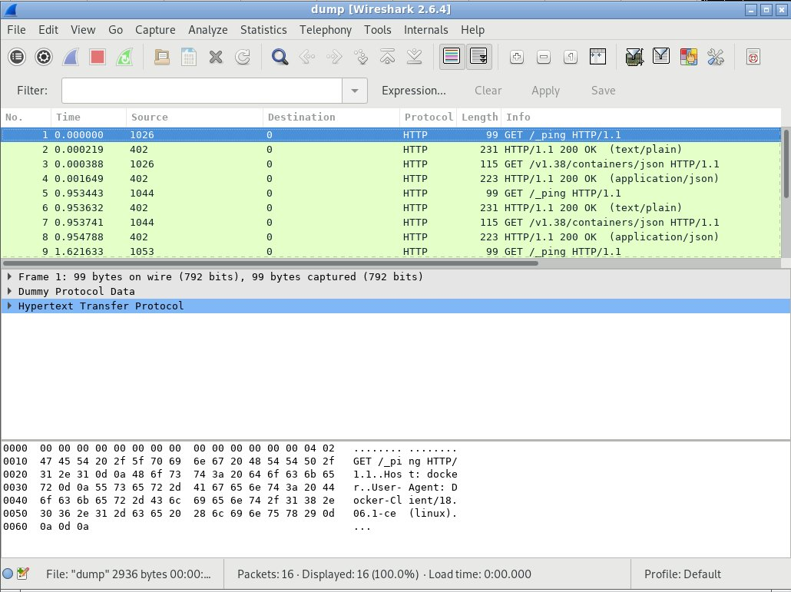

# sockdump

Dump unix domain socket traffic.

Supports STREAM and DGRAM types.

## Requirement

- bcc
- python bcc bindings

## Example

### string output

```
$ sudo ./sockdump.py --format string /var/run/docker.sock
waiting for data
19:23:06.633 >>> process docker [31042 -> 13710] len 81(81)
HEAD /_ping HTTP/1.1
Host: docker
User-Agent: Docker-Client/19.03.5 (linux)

19:23:06.633 >>> process dockerd [13710 -> 31042] len 280(280)
HTTP/1.1 200 OK
Api-Version: 1.40
Cache-Control: no-cache, no-store, must-revalidate
Content-Length: 0
Content-Type: text/plain; charset=utf-8
Docker-Experimental: false
Ostype: linux
Pragma: no-cache
Server: Docker/19.03.5 (linux)
Date: Fri, 20 Dec 2019 03:23:06 GMT

19:23:06.633 >>> process docker [31042 -> 13710] len 96(96)
GET /v1.40/containers/json HTTP/1.1
Host: docker
User-Agent: Docker-Client/19.03.5 (linux)

19:23:06.633 >>> process dockerd [13710 -> 31042] len 204(204)
HTTP/1.1 200 OK
Api-Version: 1.40
Content-Type: application/json
Docker-Experimental: false
Ostype: linux
Server: Docker/19.03.5 (linux)
Date: Fri, 20 Dec 2019 03:23:06 GMT
Content-Length: 3

[]
^C
4 packets captured
```

### hexstring output with prefix-based matching

`ptp4l` + `pmc` used to show that sockdump can capture from all sockets starting with '/var/run/p',
as pmc uses '/var/run/pmc.$PID' socket and talks to ptp4l that listens on '/var/run/ptp4l'.
```
$ sudo ./sockdump.py '/var/run/p*' --format hexstring
waiting for data
10:11:28.968 >>> process pmc [1108317 -> 0] len 74(74)
\x0d\x12\x00\x4a\x00\x00\x00\x00\x00\x00\x00\x00\x00\x00\x00\x00\x00\x00\x00\x00\x00\x00\x00\x00\x00\x00\x00\x00\xe9\x5d\x00\x00\x04\x7f\xff\xff\xff\xff\xff\xff\xff\xff\xff\xff\x00\x00\x00\x00\x00\x01\x00\x16\x20\x00\x00\x00\x00\x00\x00\x00\x00\x00\x00\x00\x00\x00\x00\x00\x00\x00\x00\x00\x00\x00
10:11:28.968 >>> process ptp4l [896569 -> 0] len 74(74)
\x0d\x12\x00\x4a\x00\x00\x00\x00\x00\x00\x00\x00\x00\x00\x00\x00\x00\x00\x00\x00\x48\x57\xdd\xff\xfe\x07\x93\x21\x00\x00\x00\x00\x04\x7f\x00\x00\x00\x00\x00\x00\x00\x00\xe9\x5d\x00\x00\x02\x00\x00\x01\x00\x16\x20\x00\x01\x00\x00\x01\x80\xf8\xfe\xff\xff\x80\x48\x57\xdd\xff\xfe\x07\x93\x21\x00\x00
^C
2 packets captured
```

### pcap output

```
$ sudo ./sockdump.py /var/run/docker.sock --format pcap --output dump
waiting for data
^C
8 packets captured
$ wireshark -X lua_script:wireshark/dummy.lua dump
```

